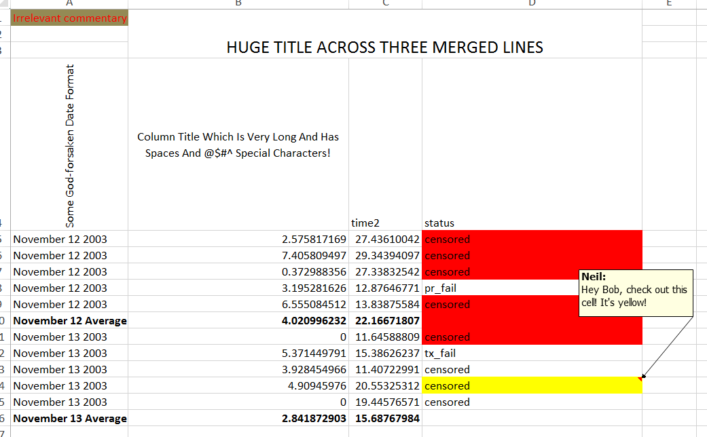
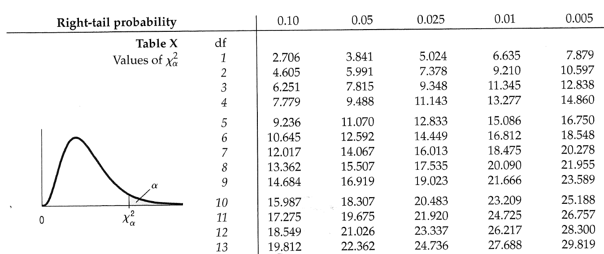
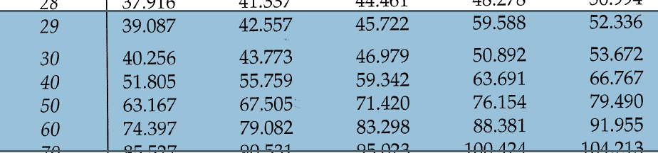

```{r setup, include=FALSE}
knitr::opts_chunk$set(echo = FALSE, cache=TRUE, fig.align = 'center', fig.height = 3, fig.asp=0.618)
options(tibble.width=70)
```

# admin

## contact, notes

|
-------------|---------------------------------------------------------------------
date format  | YYYY-MM-DD -- *All Hail ISO8601!!!*
instructor   | Neil Montgomery
email        | neilmontg@gmail.com
office       | TBA
office hours | Tuesday and Thursday 18:10 to 19:00
website      | portal (announcements, grades, suggested exercises, etc.)
github       | https://github.com/sta221-summer-2017 (lecture material, code, etc.)

Note: I will be in \textbf{this room} from 18:10 to 19:00 to answer any questions and solve any problems in an open setting. If you need a private meeting, please make an appointment for some other time.

## evaluation, readings, tutorials

what | when | how much
-----|------|---------
midterm 1 | 2017-07-18 | 25%
midterm 2 | 2017-08-03 | 25%
exam | TBA | 50%

I will provide readings that will contain some suggested exercises, throughout the course.

We are not a big enough course to merit a TA, so there will be no tutorials.

Any thick and comprehensive "Stats 101" book could also be a good resource.

## software 

Data analysis requires a computer. Also, some concepts can be illustrated using simulation, which also requires a computer. I will be using `R`. It's pretty good at data analysis. You should use it too, but I can't force you.

language | interpreter | integrated development environment
---------|-------------|-----------------------------------
`R`      | `R`         | `RStudio`

Some detailed instructions and suggestions for installation and configuration will appear on the course website. I will try to impart some data analysis workflow wisdom throughout the course. Some already appears in the detailed instructions. 

A really thorough resource for learning `R` is here:

Grolemund, G., Wickham, H., *R for Data Science* **available free at http://r4ds.had.co.nz/**


# pre-preliminaries---what is a dataset?

## most datasets are rectangles

Columns are the *variables*.

The top row has the names of the variables; possibly chosen wisely.

Rows are the *observations* of measurements taken on *units*.

There are no averages, no comments (unless in a "comment" variable), no colors, no formatting, no plots!

## not a dataset



## not a dataset


## an oil readings dataset (wide version)

```{r, message=FALSE}
library(tidyverse)
library(readxl)
oil <- read_excel("oil_readings.xlsx")
oil
```

## oil readings with `Ident` and `TakenBy` properly treated

```{r}
oil <- oil %>% mutate(Ident = factor(Ident), TakenBy = factor(TakenBy))
oil
```


## oil readings dataset (long version)

```{r}
oil_long <- oil %>% 
  gather(element, ppm, -Ident:-TakenBy)
oil_long
```

## a (simulated) "gas pipeline" dataset

```{r}
gas <- read_excel("pipeline.xlsx", col_types = rep("text", 4))
gas <- gas %>% 
  mutate(Leak=factor(Leak), Size=factor(Size, levels=c("1","1.5","1.75"), ordered=TRUE),
         Material=factor(Material), Pressure=factor(Pressure))
gas
```


## important questions

* where did the data come from?
    + were the units chosen randomly from a population?
    + were the units randomly assigned into groups?
* what are the (joint) *distributions* of the data?

## random sample, experiment, observational data

Sometimes the data come from a *random sample* from a larger *population*, in which case statements about the sample can apply to the population using laws of probability.

\pause (Not a focus of this course.)

\pause Sometimes data come from an *experiment* where units are randomly assigned to different *levels* of one or more *factors*, in which cause cause-and-effect can be inferred using laws of probability.

\pause Often the data are just some records of what happened. Grander inferences might be made, but only on a subject-matter basis.

## distribution (informally)

* A *distribution* is a 
    + Complete description of...
    + ...the possible values of one or more variables... 
    + ...and the relative frequency of those values.
    
* A dataset contains **empirical** information about distribution(s) that can be assessed
    + numerically
    + graphically  
    
* We can also consider probability models for one or more variables or a relationship among variables. (Focus of this course.) 

# important concepts from probability

# independence

## independence - definition and example

Two *events* $A$ and $B$ are *independent* if:
$$P(A \cap B) = P(A)P(B),$$
(where $\cap$ means *and*.)

For example, roll a fair die. Let $A = \{1,2,3\}$ and $B=\{2,4\}.$ 

\pause $P(A) = 1/2$ and $P(B) = 1/3$, so $P(A)P(B)=1/6$.

\pause Also, $A \cap B = \{2\}$ so $P(A\cap B) = 1/6 = P(A)P(B)$

\pause Conclude: $A$ and $B$ are independent (short form: $A \perp B.$)

\pause Exercise: if $C = \{2,5,6\}$ then $B \perp C$ and $A \not{\!\perp} C$ 

## independence - comments

Independence is normally something that is *assumed* and not something that is demonstrated.

\pause Undisciplined use of language (e.g. "$A$ has nothing to do with $B$") is the leading cause of error. Use the definition.

\pause The opposite of independent is "not independent." (Avoid "dependent", which has misleading connotations.)

\pause $A \perp B \iff A \perp B^c \iff A^c \perp B \iff A^c \perp B^c$

# random variables and distributions

## concept of random variable

A *random variable* is a rule that assigns a number to any outcome of a random process. 

Example: "Roulette". There are 38 slots on a wheel coloured as follows:

Colour | \# of slots | Slot labels
-------|----|---------------------------------
Green  | 2  | 0, 00
Red    | 18 | 1, 3, 5, 7, 9, 12, 14, 16, 18, 19, 21, 23, 25, 27, 30, 32, 34, 36
Black  | 18 | 2, 4, 6, 8, 10, 11, 13, 15, 17, 20, 22, 24, 26, 28, 29, 31, 33, 35

## roulette - II 

If bet \$100 on "Red", then these are the possibilities:

Result | I receive 
-------|-----------
Red    | 200
Not Red | 0 

Stated another way, here is my net "gain", which I will call $X$, after the play:

Result | $X$
-------|-----
Red    | 100
Not Red| -100

## roulette - III

Technically the random variable is this the *rule*:

$$X(1) = X(3) = X(5) = \cdots = X(36) = 100$$
$$X(00) = X(0) = X(2) = \cdots = X(35) = -100$$

\pause But this is often a useless technicality. This is all we care about:

$x$ | $P(X=x)$
----:|---------
100 | 18/38
-100| 20/38

This table is the *distribution* of $X$, i.e. the possible outcomes and their probabilities.

## distribution and independence

The distribution of a random variable $X$ is, roughly, all information about the values of $X$ and their probabilities. 

\pause There's the odd (or maybe not?) fact that when $X$ is *continuously measured* then we have $P(X=x)=0$ for any particular $x$. In this case we're concerned with intervals of values and not particular values.

\pause $X$ and $Y$ can be independent when *knowing the outcome of $X$ does not change the distribution of $Y$ - a very strong statement (usually assumed when appropriate.)

## expected value

Random variables can have expected values (averages, means), variances, and standard deviations, that follow these rules:

\begin{align*}
\onslide<1->{E(aX + b) &= aE(X) + b\\}
\onslide<2->{E(X + Y) &= E(X) + E(Y)\\}
\onslide<3->{\text{Var}(aX+b) &= a^2\text{Var}(X)\\}
\onslide<4->{\text{Var}(X+Y) &= \text{Var}(X) + \text{Var}(Y) \text{ when } X \perp Y}
\end{align*}

## normal distributions and the central limit theorem

Normal distributions are an important family of symmetric, bell-shaped distributions, parametrized by mean $\mu$ and standard deviation $\sigma.$

\pause They are so widely used *in statistics* because the distribution of a sample average will be approximately normal if the sample size is "large enough". 

\pause "Large enough" is not fixed, but depends on the shape of the underlying population distribution, with more skewness requiring a larger sample size.

## normal approximation illustration through simulation - I 

I can simulate picking numbers uniformly at random between 0 and 1. 

Here are histograms of 1000, 10000, and 100000 picks:

```{r}
x1 <- data_frame(k=factor(c(rep(1000, 1000), rep(10000, 10000), rep(100000, 100000))),
                 x=runif(111000))
x1 %>% 
  ggplot(aes(x=x)) + geom_histogram(boundary = 0, bins=50) + facet_wrap(~k, scales="free") 
```

## normal approximation illustration through simulation - II 

I'll settle on $k=10000$ "replications" of my simulation.

My simulation will actually consist of:
* picking $n$ numbers uniformly at random
* calculating the average of those $n$ numbers
* doing this $k$ times
* making a histogram of the results.

I will choose $n$ to be 2, 10, and 50.

## normal approximation illustration through simulation - III

```{r}
k <- 10000
unif_means <- rbind(data_frame(n=2, means=apply(replicate(k, runif(2)), 2, mean)),
      data_frame(n=10, means=apply(replicate(k, runif(10)), 2, mean)),
      data_frame(n=50, means=apply(replicate(k, runif(50)), 2, mean))) %>% 
  mutate(n=factor(n))

unif_means %>% 
  ggplot(aes(x=means)) + geom_histogram(bins=50) + facet_wrap(~n, scales = "free")
  
```

## $t$ distributions

If a population is being modeled with a $N(\mu,\sigma)$ probability model and you are going to gather a sample $X_1,X_2,\ldots,X_n$, then the following are true:

\begin{align*}
\onslide<1->{\overline{X} &\sim N(\mu, \sigma/\sqrt{n})\\}
\onslide<2->{\frac{\overline{X} - \mu}{\sigma/\sqrt{n}} &\sim N(0,1) }
\end{align*}

\pause 

\pause We usually don't know $\sigma$, but we can estimate it from the data using $s$, but then:
$$\frac{\overline{X} - \mu}{s/\sqrt{n}} \sim t_{n-1}$$

$n-1$ is called "degrees of freedom".

## degress of freedom

"Degrees of freedom" comes from the denominator $s/\sqrt{n}$. Let's look at (the square of) s:

\pause $$s^2 = \frac{\sum\limits_{i=1}^n \left(x_i - \overline{x}_i\right)^2}{n-1}$$
There's $n-1$ again! 

\pause The phrase "degrees of freedom" comes from the realization that *given the value of $\overline{x}$* the following list of number is redundant:
$$\{x_1,x_2,x_3,\ldots,x_n\}$$
From *any* $n-1$ of them, along with $\overline{x}$, you could calculate the missing value. 

## $t$ distributions - II

The $t$ distributions are (another) family of symmetric and bell-shaped distributions that look very much like $N(0,1)$ distributions.

```{r, message=FALSE}
library(tidyverse)
x <- -35:35/10
t_dists <- bind_rows(
  data_frame(Distribution="t_3", x=x, density=dt(x, 3)),
  data_frame(Distribution="t_10", x=x, density=dt(x, 10)),
  data_frame(Distribution="t_50", x=x, density=dt(x, 50)),
  data_frame(Distribution="N(0,1)", x=x, density=dnorm(x)))

t_dists %>% 
  ggplot(aes(x=x, y=density, color=Distribution)) + geom_line()
```


## estimation - confidence intervals

From the following:

$$\frac{\overline{X} - \mu}{\sigma/\sqrt{n}} \sim N(0,1) \qquad \text{and} \qquad
\frac{\overline{X} - \mu}{s/\sqrt{n}} \sim t_{n-1}$$

*which are approximately true for "large enough" $n$* we get the usual 95\% confidence intervals:

$$\overline{X} \pm 1.96\frac{\sigma}{\sqrt{n}} \qquad \text{and} \qquad
\overline{X} \pm \text{``2''}\frac{s}{\sqrt{n}}$$

I put "2" because the value (for a 95\% interval) is always close to 2.

## hypothesis testing - some very opinionated hints

Sometimes particular values of a population parameters have an obvious meaning along the lines of "no difference", "no relationship", or something similar.

\pause This obvious parameter value can be given the grand title "null hypothesis", such as in:
$$H_0: \mu_1 = \mu_2$$

\pause The "alternative" is the negation of the null. (No selecting alternatives based on hopes and dreams!), such as in:
$$H_a: \mu_1\ne\mu_2$$

\pause Modern inference is done using "p-values", which are defined as *the probability of observing a summary of the data that is more extreme than what was observed.*

## p-values

More extreme than what?

\pause \textit{More extreme than where the null hypothesis "lives"}

\pause Hypothesis testing and p-values are controversial, due to misuse, misunderstanding, and lots of other issues.

\pause Required reading: the ASA Statement on Statistical Significance and P-Values (pdf with lecture materials.)

## example ("eye drops")

Which eye drop (A or B) for pupil dilation wears off faster?

40 people are each given both eye drops on different days. The wear-out times are recorded for each person.

```{r, message=FALSE}
library(tidyverse)
mu <- 120
s <- 20
difference <- 15
s_d <- 40
n <- 40
set.seed(1)

eyedrops <- data_frame(A = rnorm(n, mu, s)) %>% 
  mutate(B = A + rnorm(n, difference, s_d), Difference=A-B)
options(tibble.print_min=5)
eyedrops
```


## example "eye drops"

Mean and standard deviation of `Difference` are:


```{r}
library(knitr)
summ <- eyedrops %>% 
  summarize("x-bar"=mean(Difference), "sd"=sd(Difference))
kable(summ, digits=2)
```

\pause The "standard error" of $\overline{x}$ is $s/\sqrt{n} = `r summ$sd / sqrt(n)`$

## the $t$ test in R

```{r}
t.test(eyedrops$Difference)
```

# goodness-of-fit testing 

## detour 1 - what tends to have a Normal distribution?

In Stats 101 you will have encountered (at least) Binomial and Normal distributions. 

\pause And we've learned that $\overline X$ is always approximately Normal when the sample is large enough.

Sums of random things also tend to be approximately Normal.

\pause A special case is the so-called "Normal approximation to the Binomial".

\pause Why? Recall that a Binomial probability model is used to *count* the number of *"successes"* in $n$ "trials". 

\pause Let's map "success" to the number 1 and "failure" to the number 0.

**Counting 1s in a sequence of 0s and 1s is exactly equivalent to adding up all the 0s and 1s**

## detour 2.1 - what happens when you look at the square of a normal?

My computer can simulate random "draws" from a standard normal (N(0,1)) distribution, resulting in a histogram such as:

```{r, message=FALSE}
library(tidyverse)

k <- 10000
data_frame(z = rnorm(k)) %>% 
  ggplot(aes(x=z)) + geom_histogram(bins=30) + ggtitle("10000 Simulated N(0,1)")
```

## detour 2.2 - what what happens when you look at the square of a normal?

I could take all of those simulated standard normals and square them, and make a histogram of the result, which would give:

\pause

```{r}
as.data.frame(replicate(1, rnorm(k))) %>% 
  mutate(sq=V1^2) %>% 
  ggplot(aes(x=sq)) + geom_histogram(bins=30, boundary=0) + ggtitle("10000 squared normals") + xlab("")
```

## detour 2.3 - sum of squared normals?

I can simulate *two* columns of standard normals, square them *both*, add the results, and make a histogram of the result:

\pause

```{r}
data_frame(ssq=apply(replicate(2, rnorm(k)), 1, function(x) sum(x^2))) %>% 
  ggplot(aes(x=ssq)) + geom_histogram(bins = 40, boundary=0) + ggtitle("10000 sums of two squared normals") + xlab("")
```

## detour 2.4 - sum of many squared normals?

I can make several columns of normals, square them, add them up, and make a histogram. Here's the histogram with 5 columns of normals:

```{r}
data_frame(ssq=apply(replicate(5, rnorm(k)), 1, function(x) sum(x^2))) %>% 
  ggplot(aes(x=ssq)) + geom_histogram(bins = 40, boundary=0) + ggtitle("10000 sums of five squared normals") + xlab("")
```

## detour - the $\chi^2$ family of distributions

If you have $n$ independent standard normals, the sum of their squares will have a $\chi^2_n$ distribution. 

\pause The $n$ is a parameter going by the name "degrees of freedom."

\pause If you have $n$ general $N(\mu, \sigma)$, say called $X_1,X_2,\ldots,X_n$, you could *standardize them*:
$$Z_i = \frac{X_i - \mu}{\sigma}$$
and then the sums of the squares of these $Z_i$ will have a $\chi^2_n$ distribution.

\pause 

## detour - pictures of some $\chi^2_n$ distributions

```{r}
x <- seq(0, 15, by=0.1)
data_frame(x) %>% 
  mutate(chisq_1 = dchisq(x, 1),
         chisq_2 = dchisq(x, 2),
         chisq_5 = dchisq(x, 5)) %>% 
  gather(key=Distribution, value=Density, -x) %>% 
  ggplot(aes(x, y=Density, color=Distribution)) + geom_line()
```

## detour - pictures of more $\chi^2_n$ distributions

```{r}
x <- seq(0, 60, by=0.3)
data_frame(x) %>% 
  mutate(chisq_10 = dchisq(x, 10),
         chisq_20 = dchisq(x, 20),
         chisq_30 = dchisq(x, 30)) %>% 
  gather(key=Distribution, value=Density, -x) %>% 
  ggplot(aes(x, y=Density, color=Distribution)) + geom_line()
```

Note: the average of a $\chi^2_n$ distribution is just $n$. 

## ever wonder why the sample variance is divided by $n-1$?

Look at the formula for sample variance:
$$s^2 = \frac{\sum\limits_{i=1}^n (x_i - \overline{x})^2}{n-1}$$
The numerator is a sum of $n$ squares, but the denominator is $n-1$. Why?

## pictures of $\sum\limits_{i=1}^5 (x_i - \overline{x})^2$

I can simulate samples of size, say, 5 and compute that numerator, and make a histogram.

\pause Here it is, with the $\chi^2_4$ distribution in blue and the $\chi^2_5$ in red:

```{r}

data.frame(ssq=apply(replicate(k, rnorm(5)), 2, 
                     function(x) sum((x-mean(x))^2))) %>% 
  ggplot(aes(x=ssq)) + geom_histogram(aes(y=..density..), bins=50, boundary=0) + xlab("") + 
  stat_function(fun=dchisq, args=list(df=4), color="Blue") + 
  stat_function(fun=dchisq, args=list(df=5), color="Red")
```

## a heuristic explanation

$s^2$ is calculated after fixing the value of $\overline{x}$

\pause So given $\overline{x}$ and *any* $n-1$ of the $n$ raw values, I can calculate that other raw value. 

\pause We say $s^2$ (given $\overline{x}$) only has $n-1$ degrees of freedom. 

# is there evidence that something doesn't follow a given distribution?

## is a lottery "fair"

Lotto 6/49 is a Canadian lottery in which 49 identical balls are mixed together and 7 are selected, now twice per week. People can win money based on how many of the numbers they have out of the 6 on their ticket.

I found a list of every number ever picked here: http://portalseven.com/lottery/canada_lotto_649.jsp

```{r}
library(readxl)
options(tibble.print_min=5)
lotto <- read_excel("649.xlsx")
lotto
```

## all 49 numbers should appear with roughly the same frequency

```{r}
all_numbers <- gather(lotto, "number", "numbers", 2:8) %>% 
  select(numbers) %>% 
  filter(!is.na(numbers)) %>% 
  mutate(numbers=factor(numbers))

all_numbers %>% 
  ggplot(aes(x=factor(numbers))) + geom_bar() + 
  theme(axis.title.x=element_blank(), axis.text.x = element_blank())
```

## categorical data, cells, observed cell counts

The dataset (now) consists of one variable called `numbers`. This is a *categorical*, or *factor* variable with 49 possible *levels*. There are `r nrow(all_numbers)` observations.

\pause A categorical variable is summarized by producing a table of *observed cell counts* (notation: $O_i$). In this case:

```{r}
all_numbers %>% 
  group_by(numbers) %>% 
  summarize(O_i=n())
```

## expected cell counts

If Lotto 6/49 is actually fair, each number would appear with probability 1/49 = `r round(1/49, 4)` each.

After `r nrow(all_numbers)` numbers have been selected, we would expect to see:
$$`r nrow(all_numbers)`\cdot\frac{1}{49} = `r round(nrow(all_numbers)/49, 2)`$$
of each number.

These are called *expected cell counts* --- calculated under the assumption of fairness as defined in this example. (Notation: $E_i$)

## measuring the deviation from the assumption of fairness

Each $O_i$ is a count (i.e. a sum of 0s and 1s), which will have an approximate normal distribution. It turns out:
$$\frac{O_i - E_i}{\sqrt{E_i}}$$
has a standard normal distribution, as long as there are enough 1s in the sample.

\pause How many? As long as $E_i \ge 10$, the approximation will be good.

\pause (Note: this is exactly like the $np \ge 10$ or $np \ge 5$ suggestion that is given for the accuracy of a normal approximation to a binomial.)

\pause The overall deviation is measured as:
$$\sum\limits_{i=1}^n \left(\frac{O_i - E_i}{\sqrt{E_i}}\right)^2 = 
\sum\limits_{i=1}^n \frac{(O_i - E_i)^2}{E_i}$$

## measuring the deviation - compared to what?

The expected cell counts $E_i$ are computed *for a given fixed sample size*  $N.$

\pause So given $n$ along with any of the $n-1$ expected cell counts, we could compute that other expected cell count.

\pause (This might *seem* trivial in this example because all the expected cell counts are the same - but this is only because our hypothesis is that all the cell probabilities are the same.)

\pause We say
$$\sum\limits_{i=1}^n \frac{(O_i - E_i)^2}{E_i}$$
has $n-1$ degrees of freedom, and it follows (approximately) a $\chi^2_{n-1}$ distribution. 

## let's measure the deviation

Here are the first few deviations (with $(O_i-E_i)^2/E_i$ called `D_i` for short):

```{r}
all_numbers_calc <- all_numbers %>% 
  group_by(numbers) %>% 
  summarize('O_i'=n()) %>% 
  mutate('E_i'=round(nrow(all_numbers)/49, 2), D_i = (O_i-E_i)^2/E_i) 
all_numbers_calc
```
The sum of the `D_i` column is `r round(sum(all_numbers_calc$D_i), 2)`. Is this number surprising?

## surprising, compared to what?

We know we should compare this number with the $\chi^2_{48}$ distribution. Here we can see we are not surprised. There is no evidence that Lotto 6/49 is unfair.

```{r}
x <- seq(0.1, 100, by=0.5)
plot(x, dchisq(x, 48), type='l', ylab="", xlab="", main="Chi-sq with 48 df")
abline(v = sum(all_numbers_calc$D_i), col="red", lwd=2)
```

## goodness of fit as formal hypothesis test - I 

Goodness-of-fit testing is a form of hypothesis testing.

\pause The null hypothesis is the result of statement that data follows a certain distribution of interest. 

\pause In the Lotto example, technically this statement is:
$$H_0: p_1 = p_2 = \cdots = p_{49} = \frac{1}{49}$$
But usually we just make $H_0$ a simple written statement:
$$H_0: \text{ the probabilities are all the same. }$$

\pause The "distribution of interest" is technically the "discrete uniform distribution on the outcomes $\{1,2,3,\ldots,49\}$"

\pause The alternative hypothesis is the negation of the null. We don't normally bother to write it down.

## goodness of fit as formal hypothesis test - II

Given a sample size $N$ and the null hypothesis probabilities, compute the $n$ expected cell counts. In this case:
$$E_i = Np_i = `r nrow(all_numbers)`\cdot\frac{1}{49} = `r round(nrow(all_numbers)/49, 2)`$$

\pause Compute the *observed value of the test statistic*:
$$\chi^2_{\text{obs}} = \sum\limits_{i=1}^n \frac{(O_i - E_i)^2}{E_i} = `r round(sum(all_numbers_calc$D_i), 2)`$$

\pause Calculate the p-value based on $\chi^2_{\text{obs}}$ being approximately $\chi^2_{n-1}$.

## goodness-if-fit testing p-value

A p-value is the *probability of observing a more extreme value*, in the sense of being further from where the null hypothesis "lives", which is where in this case?

```{r}
x <- seq(0, 60, by=0.3)
data_frame(x) %>% 
  mutate(chisq_10 = dchisq(x, 10),
         chisq_20 = dchisq(x, 20),
         chisq_30 = dchisq(x, 30)) %>% 
  gather(key=Distribution, value=Density, -x) %>% 
  ggplot(aes(x, y=Density, color=Distribution)) + geom_line()
```

## goodness-of-fit testing p-value

The p-value is $P(\chi^2_{48} \ge `r round(sum(all_numbers_calc$D_i), 2)`) = 
`r pchisq(sum(all_numbers_calc$D_i), 48, lower=FALSE)`$

\pause On tests you'll need to use a table. Here's a close-up of a table I found in a book:



## goodness-of-fit testing p-value (from table)



From a table the best you can do is to estimate the p-value.

***All this together is called the "$\chi^2$ goodness-of-fit test."***

# applications of $\chi^2$ goodness-of-fit testing to two-way tables

## contingency tables

Recall the gas pipelines data:

```{r}
gas <- read_excel("pipeline.xlsx", col_types = rep("text", 4))
gas <- gas %>% 
  mutate(Leak=factor(Leak), Size=factor(Size, levels=c("1","1.5","1.75"), ordered=TRUE),
         Material=factor(Material), Pressure=factor(Pressure))
gas
```

The (only?) suitable numerical summary for two categorical/factor variables at a time is a so-called contingency table, or two-way table.

## two-way table for "Leak" and "Pressure"

```{r, results='asis'}
library(xtable)
print(xtable(addmargins(table(gas$Leak, gas$Pressure)), digits = 0),
      comment = FALSE)
```

## the two questions

Question 1: do the rows (or columns) come from the *same* distribution?

\pause This question is answered using a *test of homogeneity*.

\pause Question 2: are the rows and columns *independent*?

\pause This question is answered using a *test of independence*.

\pause ***The mechanics of both tests are identical. Only the interpretation is (slightly) different.***

## two-way table again

Count version:

```{r, results='asis'}
library(xtable)
print(xtable(addmargins(table(gas$Leak, gas$Pressure)), digits = 0),
      comment = FALSE)
```

Proportion version:

```{r, results='asis'}
library(xtable)
print(xtable(addmargins(prop.table(table(gas$Leak, gas$Pressure))), digits = 3),
      comment = FALSE)
```


